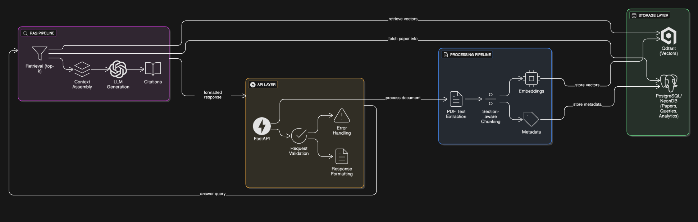

# Research Paper RAG System: Implementation Approach

This document outlines the key design decisions and implementation strategies for the Research Paper RAG system.

## Chunking Strategy

We implemented a section-aware chunking strategy that:

1. **Preserves Section Context**: Each chunk includes section information (Abstract, Introduction, Methods, Results, Discussion, Conclusion)
2. **Maintains Semantic Coherence**: Chunks are created with overlapping text to preserve context across chunk boundaries
3. **Balanced Size**: Chunks are sized to balance between:
   - TARGET_CHUNK_TOKENS=1200, MAX_CHUNK_TOKENS=1800, MIN_CHUNK_TOKENS=300, OVERLAP_TOKENS=60.

This approach ensures that when retrieving chunks for a query, we maintain the original paper's structure and context, making citations more accurate.

## Embedding Model Choice

We selected the `all-MiniLM-L6-v2` model from Sentence-Transformers for several reasons:

1. **Efficiency**: Produces 384-dimensional embeddings with excellent performance-to-size ratio
2. **Speed**: Fast inference suitable for production environments
3. **Semantic Understanding**: Well-suited for academic text with good performance on technical content
4. **Resource Requirements**: Lightweight enough to run on standard hardware

This model provides a good balance between quality and performance for academic paper retrieval.

## RAG Pipeline Design

Our RAG pipeline follows these steps:

1. **Query Understanding**: Convert user query to embedding vector
2. **Retrieval**: Find most similar chunks in Qdrant with optional paper filtering
3. **Context Assembly**: Format retrieved chunks with metadata (paper title, section, page)
4. **Prompt Engineering**: Construct a prompt that:
   - Instructs the LLM to answer based ONLY on provided context
   - Requires citations to specific papers, sections, and pages
   - Asks for a confidence score
5. **Answer Generation**: Use Ollama to generate the final response

### Prompt Engineering Approach

Our prompt is designed to:

```
You are a research assistant helping with academic papers. Answer the question based ONLY on the provided context.
If you cannot answer the question based on the context, say "I don't have enough information to answer this question."

CONTEXT:
[Document details and content]

QUESTION:
[User query]

INSTRUCTIONS:
1. Answer the question concisely and accurately based only on the provided context.
2. Cite specific papers, sections, and page numbers in your answer.
3. Do not make up information or use knowledge outside the provided context.
4. If the context contains conflicting information, acknowledge this in your answer.
5. Format your answer in a clear, structured way.
6. At the end, include a confidence score between 0.0 and 1.0 on a new line in this format: "CONFIDENCE: 0.X"
```

This prompt structure ensures:
- Answers are grounded in the provided context
- Citations are specific and traceable
- The system acknowledges uncertainty when appropriate

## Database Schema Design

We designed the database schema to efficiently store:

1. **Papers**: Metadata about uploaded papers (title, authors, year)
2. **Paper Chunks**: Segments of papers with section and page information
3. **Queries**: User questions and response metrics
4. **Citations**: Tracking which papers were referenced in answers

Here’s a **clear table-wise breakdown** of out database schema — showing **columns, primary keys, and foreign keys** for each table defined in your SQLAlchemy models:

---

### 🧩 **1. `papers`**

| Column        | Type        | Key    | Description               |
| ------------- | ----------- | ------ | ------------------------- |
| `id`          | Integer     | **PK** | Unique paper identifier   |
| `title`       | String(255) |        | Paper title               |
| `authors`     | String(255) |        | Author list               |
| `year`        | Integer     |        | Publication year          |
| `filename`    | String(255) |        | Original filename         |
| `file_path`   | String(255) |        | Local/remote storage path |
| `uploaded_at` | DateTime    |        | Timestamp of upload       |

**Relationships:**

* 🔁 One-to-many with `paper_chunks` → `PaperChunk.paper_id`
* 🔁 Many-to-many with `queries` via `query_papers`
* 🔁 One-to-many with `citations` → `Citation.paper_id`

---

### 📑 **2. `paper_chunks`**

| Column        | Type        | Key                | Description                         |
| ------------- | ----------- | ------------------ | ----------------------------------- |
| `id`          | Integer     | **PK**             | Unique chunk identifier             |
| `paper_id`    | Integer     | **FK → papers.id** | Parent paper                        |
| `content`     | Text        |                    | Text content of the chunk           |
| `section`     | String(100) |                    | Section name (e.g., “Introduction”) |
| `page_number` | Integer     |                    | Page number of the chunk            |
| `chunk_index` | Integer     |                    | Sequential chunk index              |
| `vector_id`   | String(255) |                    | Corresponding Qdrant vector ID      |

**Relationships:**

* 🔁 Many-to-one with `papers`
* 🔁 One-to-many with `citations` → `Citation.chunk_id`

---

### ❓ **3. `queries`**

| Column             | Type     | Key    | Description                  |
| ------------------ | -------- | ------ | ---------------------------- |
| `id`               | Integer  | **PK** | Unique query identifier      |
| `text`             | Text     |        | User query text              |
| `created_at`       | DateTime |        | Time of query                |
| `response_time_ms` | Float    |        | Response time (milliseconds) |
| `user_rating`      | Integer  |        | Optional user rating         |

**Relationships:**

* 🔁 Many-to-many with `papers` via `query_papers`
* 🔁 One-to-one with `query_answers` → `QueryAnswer.query_id`
* 🔁 One-to-many with `citations` → `Citation.query_id`

---

### 💬 **4. `query_answers`**

| Column     | Type    | Key                         | Description           |
| ---------- | ------- | --------------------------- | --------------------- |
| `query_id` | Integer | **PK**, **FK → queries.id** | Query reference       |
| `answer`   | Text    |                             | Generated answer text |

**Relationships:**

* 🔁 One-to-one with `queries`

---

### 🔗 **5. `query_papers`** (Association Table)

| Column     | Type    | Key                         | Description     |
| ---------- | ------- | --------------------------- | --------------- |
| `query_id` | Integer | **PK**, **FK → queries.id** | Query reference |
| `paper_id` | Integer | **PK**, **FK → papers.id**  | Paper reference |

**Relationships:**

* Implements many-to-many between `queries` and `papers`

---

### 📚 **6. `citations`**

| Column            | Type        | Key                      | Description                   |
| ----------------- | ----------- | ------------------------ | ----------------------------- |
| `id`              | Integer     | **PK**                   | Unique citation ID            |
| `query_id`        | Integer     | **FK → queries.id**      | Related query                 |
| `paper_id`        | Integer     | **FK → papers.id**       | Related paper                 |
| `chunk_id`        | Integer     | **FK → paper_chunks.id** | Cited chunk                   |
| `section`         | String(100) |                          | Section name                  |
| `page`            | Integer     |                          | Page number                   |
| `relevance_score` | Float       |                          | Similarity or relevance value |

**Relationships:**

* 🔁 Many-to-one with `queries`
* 🔁 Many-to-one with `papers`
* 🔁 Many-to-one with `paper_chunks`


The schema supports:
- Efficient paper retrieval and management
- Query history analysis
- Citation tracking for analytics

## SYSTEM OVERVIEW


## Async Implementation

The entire system is built with asynchronous operations:

1. **FastAPI**: Async request handling
2. **Database**: AsyncPG with SQLAlchemy async ORM
3. **PDF Processing**: Async methods for text extraction and chunking
4. **Embedding Generation**: Batched async processing
5. **LLM Calls**: Async HTTP requests to Ollama/DeepSeek

This approach ensures high throughput and responsiveness, even under load.

## Trade-offs and Limitations

1. **PDF Extraction Quality**: PDF extraction can be imperfect, especially with complex layouts or equations
2. **Embedding Model Size**: Chose a smaller model for speed, sacrificing some semantic understanding
3. **Citation Precision**: Citations are based on chunk boundaries, which may not perfectly align with paper structure
4. **Query Complexity**: Very complex queries spanning multiple papers may require refinement

## Future Improvements

1. **Hybrid Search**: Combine vector search with keyword search for better retrieval
2. **Improved PDF Extraction**: Better handling of tables, figures, and equations
3. **Multi-stage Retrieval**: Implement re-ranking of initial search results
4. **User Feedback Loop**: Incorporate user ratings to improve retrieval and answer quality
5. **Caching**: Implement response caching for common queries
